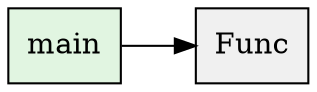
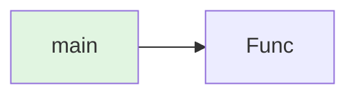

# Code Intelligence Features

## Overview

Juleson now includes comprehensive code intelligence capabilities that enable deep analysis of Go codebases. These features provide the agent with the ability to understand code structure, dependencies, call graphs, and complexity metrics.

## Features

### 1. Code Graph Analysis

Build and analyze call graphs to understand function relationships and dependencies.

**Capabilities:**

- Parse Go source code and build complete call graphs
- Detect entry points (main functions, exported functions)
- Identify circular dependencies and call cycles
- Calculate graph complexity metrics
- Export graphs to DOT (Graphviz) and Mermaid formats

**MCP Tool:** `analyze_code_graph`

**Example:**

```json
{
  "project_path": "./my-project",
  "include_tests": false,
  "output_format": "mermaid"
}
```

**Output:**

- List of all nodes (functions, methods, types)
- Call edges with dynamic call indicators
- Entry points and cycles
- Graph statistics (complexity, avg outdegree, etc.)
- Optional diagram in DOT or Mermaid format

### 2. Code Context Analysis

Analyze individual files to extract symbols, imports, and structure.

**Capabilities:**

- Extract all symbols (functions, methods, types, vars, consts)
- Parse import statements with alias detection
- Generate function signatures
- Extract documentation comments
- Identify exported vs internal symbols

**MCP Tool:** `analyze_code_context`

**Example:**

```json
{
  "file_path": "./cmd/main.go",
  "symbol_name": "main",
  "context_lines": 5
}
```

**Output:**

- File metadata (package, lines, imports)
- Symbol information with locations
- Import details (normal, alias, dot, blank)
- Optional references and dependencies

### 3. Symbol Reference Finding

Find all references to a symbol across the entire project.

**Capabilities:**

- Search across all packages
- Identify definition vs reference vs call sites
- Provide precise file locations (line and column)
- Support for functions, types, variables, and constants

**MCP Tool:** `find_symbol_references`

**Example:**

```json
{
  "project_path": "./my-project",
  "symbol_name": "BuildCodeGraph"
}
```

**Output:**

- List of all references with locations
- Reference kind (definition, reference, call)
- Total reference count

### 4. Static Analysis

Run comprehensive static analysis checks on Go code.

**Capabilities:**

- Detect unused variables
- Identify high complexity functions
- Run golang.org/x/tools analyzers:
  - `assign`: Check for useless assignments
  - `atomic`: Check for common atomic mistakes
  - `bools`: Check for Boolean mistakes
  - `errorsas`: Check errors.As usage
  - `printf`: Check printf-style calls
  - `unreachable`: Check for unreachable code
  - And 15+ more analyzers

**MCP Tool:** `run_static_analysis`

**Example:**

```json
{
  "project_path": "./my-project",
  "analyzers": ["unused", "complexity", "errorsas"],
  "severity": "warning"
}
```

**Output:**

- List of issues with categories and severity
- Suggestions for fixes
- Summary statistics by category and severity

### 5. Complexity Analysis

Calculate code complexity metrics for functions and projects.

**Capabilities:**

- Cyclomatic complexity calculation
- Cognitive complexity estimation
- Lines of code metrics
- Average complexity per function
- Identify high-complexity hotspots

**MCP Tool:** `analyze_complexity`

**Example:**

```json
{
  "project_path": "./my-project",
  "file_path": "./internal/analyzer/project.go"
}
```

**Output:**

- Complexity metrics (cyclomatic, cognitive, lines)
- List of complexity issues
- Recommendations for refactoring

## Architecture

### Package Structure

```
internal/codeintel/
├── types.go           # Common type definitions
├── graph/             # Code graph analysis
│   ├── builder.go     # Graph construction
│   ├── graph.go       # Graph operations
│   └── exporter.go    # DOT/Mermaid export
├── context/           # Code context analysis
│   └── analyzer.go    # Symbol and import extraction
└── static/            # Static analysis
    └── runner.go      # Analysis execution
```

### Integration

Code intelligence tools are registered in the MCP server alongside existing tools:

```go
// In internal/mcp/server.go
tools.RegisterCodeIntelTools(s.server)
```

## Usage Examples

### Example 1: Analyze Project Call Graph

```bash
# Using MCP client (e.g., Claude Desktop)
{
  "tool": "analyze_code_graph",
  "arguments": {
    "project_path": "/path/to/juleson",
    "include_tests": true,
    "output_format": "mermaid"
  }
}
```

**Result:**

- Visual call graph showing all functions
- Entry points highlighted
- Circular dependencies identified
- Complexity metrics calculated

### Example 2: Find All Uses of a Function

```bash
{
  "tool": "find_symbol_references",
  "arguments": {
    "project_path": "/path/to/juleson",
    "symbol_name": "AnalyzeProject"
  }
}
```

**Result:**

- All files calling `AnalyzeProject`
- Exact line and column numbers
- Distinction between definition and calls

### Example 3: Run Static Analysis

```bash
{
  "tool": "run_static_analysis",
  "arguments": {
    "project_path": "/path/to/juleson",
    "analyzers": ["all"],
    "severity": "warning"
  }
}
```

**Result:**

- List of all warnings and errors
- Categories: unused, complexity, security, etc.
- Actionable suggestions for fixes

### Example 4: Analyze File Context

```bash
{
  "tool": "analyze_code_context",
  "arguments": {
    "file_path": "/path/to/juleson/internal/analyzer/project.go",
    "context_lines": 10
  }
}
```

**Result:**

- All functions and types in the file
- Import dependencies
- Function signatures
- Documentation comments

## Advanced Features

### Call Graph Visualization

Export call graphs to industry-standard formats:

**DOT (Graphviz):**



**Mermaid:**



### Complexity Metrics

Calculate various complexity metrics:

- **Cyclomatic Complexity:** Number of linearly independent paths through code
- **Cognitive Complexity:** How difficult code is to understand
- **Lines of Code:** Physical lines and logical lines
- **Function Count:** Total functions analyzed
- **Average Complexity:** Avg complexity per function

### Static Analysis Categories

Issues are categorized for easy filtering:

- `bug`: Potential bugs
- `code_smell`: Code quality issues
- `security`: Security vulnerabilities
- `performance`: Performance issues
- `complexity`: High complexity
- `unused`: Unused code
- `deprecated`: Deprecated usage
- `style`: Style violations

## Integration with Jules AI

The code intelligence tools enable Jules AI to:

1. **Better Understand Codebases:** Parse and analyze structure before making changes
2. **Intelligent Refactoring:** Identify complexity hotspots and suggest targeted refactoring
3. **Dependency Analysis:** Understand call graphs before modifying functions
4. **Context-Aware Changes:** See all references before renaming or moving symbols
5. **Quality Assurance:** Run static analysis before and after changes

## Performance Considerations

- **Large Projects:** Graph analysis may take time for projects with >10k functions
- **Caching:** Results can be cached for repeated analysis
- **Incremental Analysis:** Focus on specific files or packages when possible
- **Parallel Processing:** Multiple files can be analyzed concurrently

## Future Enhancements

Planned improvements:

1. **Multi-Language Support:** Extend to Python, JavaScript, TypeScript
2. **Advanced Metrics:** More sophisticated complexity calculations
3. **Machine Learning:** AI-powered code smell detection
4. **Cross-File Refactoring:** Automated refactoring suggestions
5. **Performance Profiling:** Integration with pprof for performance analysis
6. **Test Coverage Integration:** Combine coverage data with complexity metrics

## References

- [Go AST Package](https://pkg.go.dev/go/ast)
- [Go Analysis Framework](https://pkg.go.dev/golang.org/x/tools/go/analysis)
- [Go Packages](https://pkg.go.dev/golang.org/x/tools/go/packages)
- [Cyclomatic Complexity](https://en.wikipedia.org/wiki/Cyclomatic_complexity)
- [Cognitive Complexity](https://www.sonarsource.com/docs/CognitiveComplexity.pdf)

---

**Last Updated:** November 3, 2025
